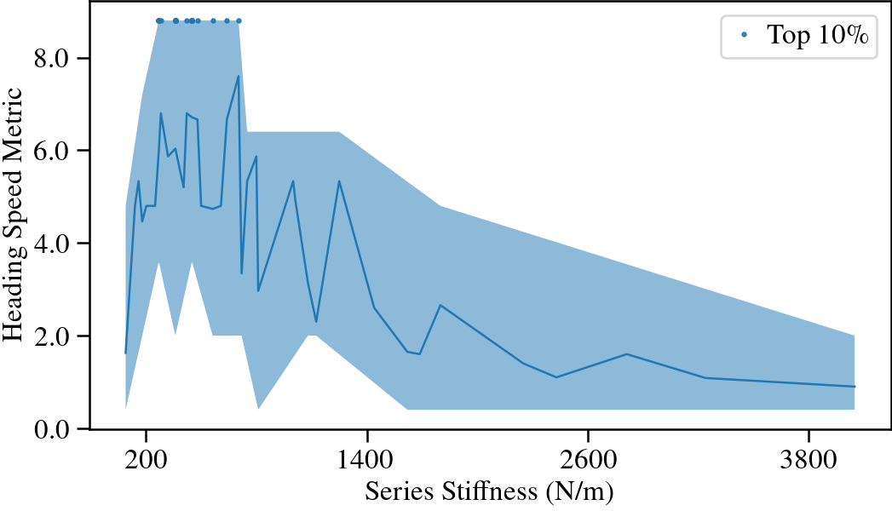
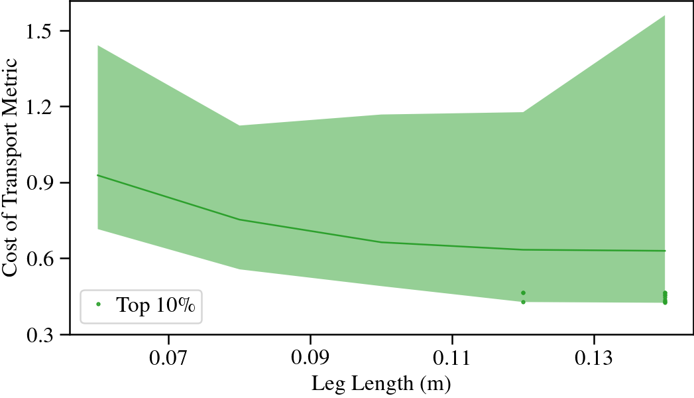

  <video autoplay muted controls>
    <source src="assets/videos/dashes.mp4" type="video/mp4" />
    Your browser does not support the video tag.
  </video>
  <video autoplay muted controls>
    <source src="assets/videos/pulls.mp4" type="video/mp4" />
    Your browser does not support the video tag.
  </video>

# Abstract
Having a well-rounded fixed leg design for a quadruped inevitably limits performance across diverse tasks, while tunability enables specialization and leads to better performance. We introduce a sub-500-gram quadruped robot with a rich leg design space. Reinforcement learning is used to train a locomotion policy that works across designs and exploits their unique dynamics. It also enables mapping from designs to task performance, where interpretable and insightful performance trends and design principles emerge. 

With two papers, we showcase the proposed methdos in selecting leg designs for two distinct tasks: pure locomotion, such as running and turning, and force-based locomotion, such as pulling, pushing, and carrying payloads.

# Tunable Legs
The proposed leg design has a range of tunable design parameters, including leg length, foot travel, transmission ratio, and passive parallel and series stiffness. Thanks to  laminate design and fabrication techniques, it is also straightforward to model, low-cost, and fast to manufacture. Its feasible leg design space can be spanned with a "flood fill" algorithm. 400 designs were generated and 6 designs were made. 

# Design-aware Policies
The locomotion policies observe leg designs. Curriculum strategies, also similar to "flood fill", are employed to gradually increase the task difficulties, so that each design's physical limits can be individually identified and reached. 

  <video muted controls>
    <source src="assets/videos/loc_sims.mp4" type="video/mp4" />
    Your browser does not support the video tag.
  </video>
  <video muted controls>
    <source src="assets/videos/forced_loc_sims.mp4" type="video/mp4" />
    Your browser does not support the video tag.
  </video>

# Trend Discoveries

  
  

